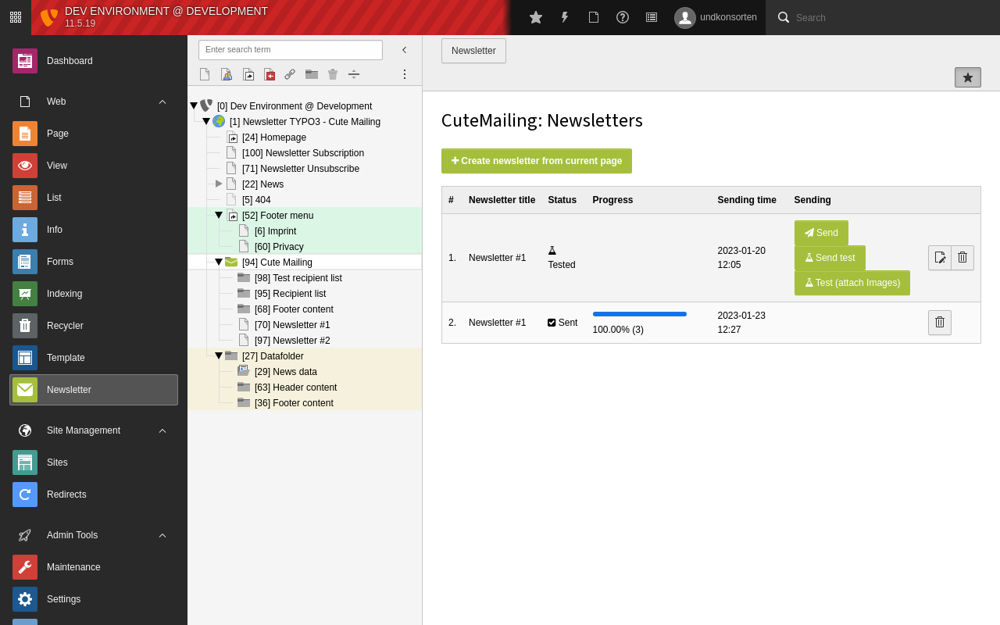

### Cute Mailing

Pronounced [kø] "queued" mailing :grin:

A TYPO3 extension that makes mail and newsletter sending cute.

[Documentation](./Documentation/Index.rst)

[Link to TYPO3 docs](https://docs.typo3.org/p/undkonsorten/typo3-cute-mailing/main/en-us/)
